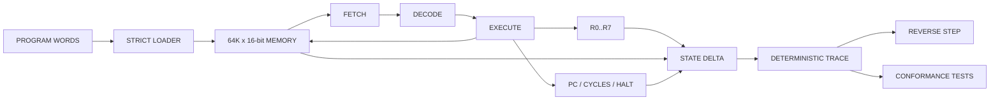

CINDER-16
=========

A SMALL 16-BIT MACHINE WITH AN HONEST DEBUGGER.

STATUS
------

v0.1 bootstrap is under active construction.

CINDER-16 is a clean-room 16-bit virtual machine written in Io. The machine is
small by design: fixed-width instructions, eight general-purpose registers,
64K words of memory, deterministic cycle accounting, and an execution trace
that can restore the exact prior architectural state.

The first milestone is not a GUI and not a fantasy operating system. It is a
machine core whose behavior can be specified, observed, reversed, and tested.

ARCHITECTURE
------------



CURRENT SLICE
-------------

- Custom CINDER-16 ISA specification.
- 16-bit wrapping arithmetic.
- 65,536-word checked memory.
- Eight writable 16-bit registers.
- Deterministic program counter and cycle counter.
- NOP, LDI, MOV, ADD, SUB, LD, ST, JMP, JZ, AND, OR, XOR, SHL, SHR, HALT.
- Invalid opcode trap.
- Per-instruction register and memory deltas.
- Exact reverse-step restoration.
- Core self-tests.

LOCAL TEST
----------

CINDER-16 does not require GitHub Actions.

Run this from the repository root in PowerShell:

```text
powershell -ExecutionPolicy Bypass -File tools/test.ps1
```

The first run performs a local bootstrap when `io.exe` is not already available:

```text
1. Clone Io tag 2026.04.20-native-final into .tools/.
2. Configure a Release build with CMake.
3. Build the static Io interpreter.
4. Copy it to .tools/bin/io.exe.
5. Execute tests/core_test.io.
```

Required host commands:

```text
git
cmake
C compiler toolchain
```

MinGW-W64 is preferred when `mingw32-make` is available. Ninja is used when
available. Otherwise CMake selects the installed default toolchain, such as
Visual Studio Build Tools.

The bootstrap does not install system packages, modify PATH, or use a remote
runner. Generated source and binaries remain under the ignored `.tools/`
directory.

Force a clean runtime rebuild:

```text
powershell -ExecutionPolicy Bypass -File tools/test.ps1 -RebuildRuntime
```

A missing compiler or CMake is classified as a toolchain failure. A CINDER-16
test result exists only after `tests/core_test.io` executes and returns an exit
code.

LAYOUT
------

```text
docs/ISA.md              Machine contract.
docs/ARCHITECTURE.md     State and reversibility design.
src/Cinder16.io          Machine implementation.
tests/core_test.io       Executable core tests.
tools/bootstrap-io.ps1   Pinned local Io build.
tools/test.ps1           Local test entry point.
LICENSE                  GNU GPL version 2.
```

NON-GOALS
---------

NO GUI.
NO JIT.
NO NETWORK.
NO AUDIO.
NO PLUGIN SYSTEM.
NO PACKAGE MANAGER.
NO FAKE OS.

LICENSE
-------

GNU General Public License version 2. See LICENSE.
