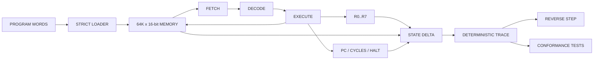

CINDER-16
=========

A SMALL 16-BIT MACHINE WITH AN HONEST DEBUGGER.

STATUS
------

v0.1 bootstrap is under active construction.

CINDER-16 is a clean-room 16-bit virtual machine written in Io. The machine is
small by design: fixed-width instructions, eight general-purpose registers,
64K words of memory, deterministic cycle accounting, and an execution trace
that can restore the exact prior architectural state.

The first milestone is not a GUI and not a fantasy operating system. It is a
machine core whose behavior can be specified, observed, reversed, and tested.

ARCHITECTURE
------------



CURRENT SLICE
-------------

- Custom CINDER-16 ISA specification.
- 16-bit wrapping arithmetic.
- 65,536-word checked memory.
- Eight writable 16-bit registers.
- Deterministic program counter and cycle counter.
- NOP, LDI, MOV, ADD, SUB, LD, ST, JMP, JZ, AND, OR, XOR, SHL, SHR, HALT.
- Invalid opcode trap.
- Per-instruction register and memory deltas.
- Exact reverse-step restoration.
- Core self-tests.

TEST
----

The current Io upstream runtime is WASI-based. GitHub Actions builds a pinned Io
commit with wasi-sdk 24.0 and runs it under Wasmtime 27.0.0. This is the
authoritative bootstrap test gate.

A native Io interpreter may run the suite directly:

```text
io tests/core_test.io
```

A built Io WASI runtime may run it from the repository root:

```text
wasmtime --dir=. path/to/io_static tests/core_test.io
```

The test process exits non-zero on the first failed assertion. A missing `io`
command is a missing runtime, not a CINDER-16 test result.

LAYOUT
------

```text
.github/workflows/core.yml  Pinned Io/WASI execution gate.
docs/ISA.md                 Machine contract.
docs/ARCHITECTURE.md        State and reversibility design.
src/Cinder16.io             Machine implementation.
tests/core_test.io          Executable core tests.
LICENSE                     GNU GPL version 2.
```

NON-GOALS
---------

NO GUI.
NO JIT.
NO NETWORK.
NO AUDIO.
NO PLUGIN SYSTEM.
NO PACKAGE MANAGER.
NO FAKE OS.

LICENSE
-------

GNU General Public License version 2. See LICENSE.
