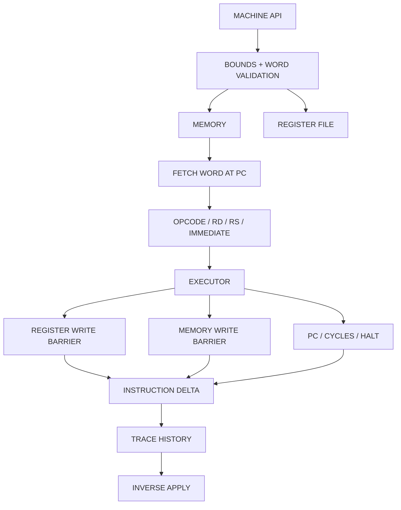

CINDER-16 ARCHITECTURE
======================

DESIGN RULE
-----------

STATE CHANGES ARE DATA.

The executor never relies on a textual log to reverse execution. Every
architectural mutation is performed through a write barrier that stores the
previous value in the current instruction delta before committing the new
value.

COMPONENTS
----------



INVARIANTS
----------

```text
I1  Every register value is within 0x0000..0xffff.
I2  Every memory word is within 0x0000..0xffff.
I3  PC is within 0x0000..0xffff.
I4  A valid step appends exactly one delta.
I5  An invalid step appends no delta and changes no architectural state.
I6  Reverse-step removes exactly one delta.
I7  Step followed by reverse-step restores exact pre-state.
I8  Program loading is not instruction execution and produces no trace.
```

OBJECT MODEL
------------

`Cinder16Machine new` creates independent mutable state. Lists are allocated
during initialization instead of being stored as mutable objects on the shared
prototype.

`Cinder16Delta` contains only the state required to invert one instruction.
Register and memory write records are objects containing an index/address and
the value that existed before the write.

FAILURE MODEL
-------------

Public memory and register access validates indices explicitly. Program loading
rejects images larger than memory and masks each accepted word to 16 bits.

The following are hard failures:

```text
invalid register index
invalid memory address
oversized program image
execution after HALT
execution budget exhausted
reverse-step with empty history
opcode 0xF
```

TEST STRATEGY
-------------

The bootstrap tests cover:

```text
word wrapping
LDI and ADD
memory store/load
conditional branch
HALT behavior
forward/reverse register restoration
forward/reverse memory restoration
invalid opcode atomicity
run budget failure
```

RUNTIME EVIDENCE
----------------

A committed test file is not evidence that the Io interpreter executed it.
Until CI or a local Io runtime reports the process exit status, runtime status
must be reported as UNVERIFIED.
